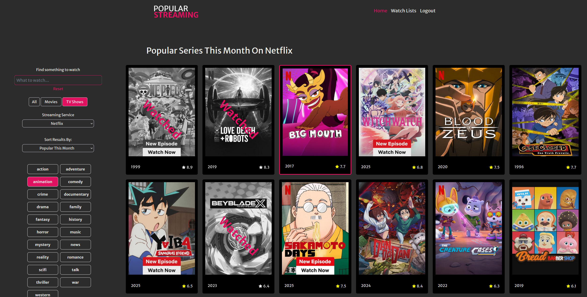

# Popular Streaming



## Project Overview

This is full-stack web application that allows the users to search for tv shows and movies that are streaming across many services. The user can login to save their own watch list and list of previously seen shows. While the user is logged it all of the shows will highlight the ones from their watch list and previously seen lists.

## Tech Overview

3rd Party API that finds information about shows on

- [Streaming Availability](https://www.movieofthenight.com/about/api)

Backend Stack

- [NodeJS](https://nodejs.org/en)
- [ExpressJS](https://expressjs.com/)
- [SQLite](https://www.sqlite.org/)

Frontend Stack

- HTML, CSS, Javascript
- [ReactJS](https://react.dev/)
- [TailwindCSS](https://tailwindcss.com/)

---

## Features

| Requirement                                                                                                                                                                           | Implementation                                                                                                                                                                                                                                      |
| ------------------------------------------------------------------------------------------------------------------------------------------------------------------------------------- | --------------------------------------------------------------------------------------------------------------------------------------------------------------------------------------------------------------------------------------------------- |
| **Retrieve data from a third-party API**                                                                                                                                              | • Integrated [Streaming Availability API](https://www.movieofthenight.com/about/api) to access information about streaming shows<br>                                                                                                                |
| **Use a regular expression to validate user input and either prevent the invalid input or inform the user about it (in all cases prevent invalid input from being stored or saved).** | • Implemented regular expressions to validate all information to the routes accessing the 3rd Party API<br>• Implemented regular expressions to valid email addresses entered when registering an account                                           |
| **Use arrays, objects to store and retrieve information**                                                                                                                             | • All returned information from the Express backend is in array and object format<br>• The arrays and objects are manipulated to iterate over the information and present it to the user.                                                           |
| **Persist data to an internal API and make the stored data accessible in your app.**                                                                                                  | • All entered form data is stored to local storage to save the user's progress<br>• All user information and watchlist information are stored in a database                                                                                         |
| **Responsive Design**                                                                                                                                                                 | • Implemented responsive design using grid and flexbox<br>• Used tailwindCSS to create a mobile first approach                                                                                                                                      |
| **Create a node.js web server using a modern framework such as Express.js.**                                                                                                          | • Implemented a node.js web server using Express to act as a proxy for 3rd Party API calls<br> • The same Express API handles multiple routes to manage users and user show list information                                                        |
| **Interact with a SQLite database to store and retrieve information**                                                                                                                 | • Implemented a SQLite database that stores all user information including hashed passwords stored securely<br>• Implemented tables that store users, shows that are up next for the user, and shows that have already been watched by the user<br> |
| **Develop your project using a common JavaScript framework such as React, Svelte, or Vue.**                                                                                           | • Implemented the frontend using the ReactJS library<br>• React allows for an enhanced user experience like real-time updates to the information requested by the user through forms                                                                |

---

## Setup

1.  **Clone the repo to your desktop using git**

    ```bash

    git clone https://github.com/AnthonyTGarrett/popular_streaming.git
    ```

2.  **Change directory into the cloned folder**

    ```bash
    cd popular_streaming
    ```

3.  **Install the base dependency to run the project**

    ```bash
    npm install
    ```

4.  **Install all dependency for frontend and backend**
    ```bash
    npm run installAll
    ```
5.  **You will need an environment file for the backend to access the API**

    ```bash
    cd popular_streaming/backend
    ```

    Paste the provided .env file into the backend folder with the .env name.
    The content will be the following but with a valid private API key

    ```bash
    PORT = 8080
    CLIENT_ID = My_Private_API_key
    secretKey = 'This#isSecretkeyed(yup)';
    ```

6.  **Run the App and navigate to http://localhost:5173**

    ```bash
    npm start
    ```

## Usage

After first startup you will have to create a new user to be able to save shows to your watchlist and to view the watched and next up lists.

This can be done at http://localhost:5173/register

---

## License

> You can check out the full license [here](https://github.com/IgorAntun/node-chat/blob/master/LICENSE)

This project is licensed under the terms of the **MIT** license.

```

```
